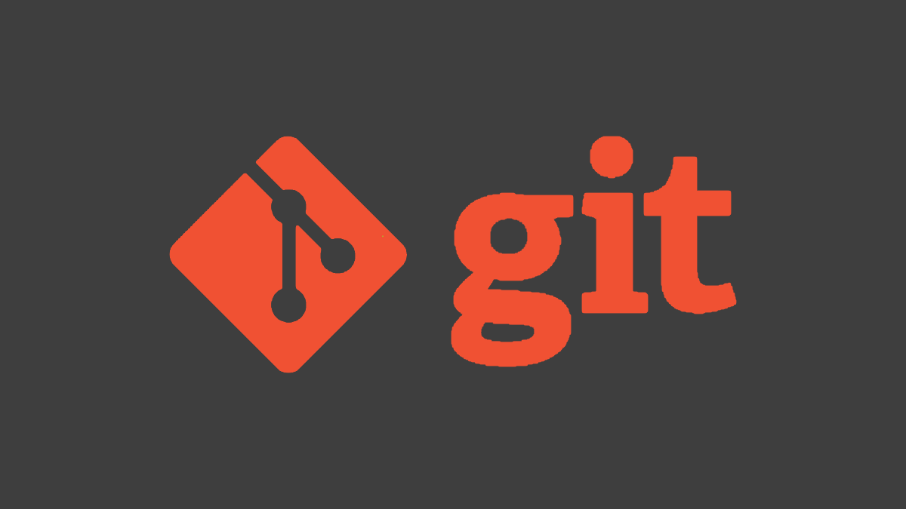

# Работа с Git
## 1. Проверка наличия установленного Git
В терминале выполнить команду `git version `.

Если Git установлен, появится сообщение с информацией о версии программы. Иначе будет сообщение об ошибке.

## 2. Установка Git
Загружаем последнюю версию Git c сайта https://git-scm.com/downloads
Устанавливаем с настройками по умолчанию.

# 3. Настройка Git

При первом использовании Git необходимо представиться. Для этого нужно ввести в терминале две команды:
```
git config --global user.name «Ваше имя английскими буквами»
git config --global user.email ваша почта@example.com
```
# 4. Инициализация репозитория

*Репозитарием Git является виртуальное хранилище проекта. В нем можно хранить версии кода для доступа по мере необходимости.*

Создадим наш первый репозиторий. Для этого пройдите в папку вашего проекта.

 В разных операционных системах это выглядит по-разному.

Например, для Linux
```
cd /home/user/my_project
```
Для macOS
```
cd /Users/user/my_project
```
для Windows
```
cd С://MyProject
```
А затем выполните коммаду:
```
git init
```

Теперь папка "MyProject" - инициализированный депозитарий!

# 5. Запись изменений в репозиторий

**Запомните, каждый файл в вашем рабочем каталоге может находиться в одном из двух состояний: под версионным контролем (отслеживаемые) и нет (неотслеживаемые).**
```
отслеживаемые файлы — это те файлы, о которых знает Git
```
```
Неотслеживаемые файлы — это всё остальное, любые файлы в вашем рабочем каталоге, которые не входили в ваш последний снимок состояния и не подготовлены к коммиту
```
**Основной инструмент, используемый для определения, какие файлы в каком состоянии находятся — это команда `git status`. Если вы выполните эту команду сразу после клонирования, вы увидите что-то вроде этого:**
```
$ git status
On branch master
Your branch is up-to-date with 'origin/master'.
nothing to commit, working tree clean
```
Это означает, что у вас чистый рабочий каталог, другими словами — в нем нет отслеживаемых измененных файлов. `Git` также не обнаружил неотслеживаемых файлов, в противном случае они бы были перечислены здесь. Наконец, команда сообщает вам на какой ветке вы находитесь и сообщает вам, что она не расходится с веткой на сервере.

Предположим, вы добавили в свой проект новый файл, простой файл README. Если этого файла раньше не было, и вы выполните git status, вы увидите свой неотслеживаемый файл вот так:
```
$ echo 'My Project' > README
$ git status
On branch master
Your branch is up-to-date with 'origin/master'.
Untracked files:
  (use "git add <file>..." to include in what will be committed)

    README

nothing added to commit but untracked files present (use "git add" to track)
```
Понять, что новый файл README неотслеживаемый можно по тому, что он находится в секции «Untracked files» в выводе команды status. Статус `Untracked` означает, что Git видит файл, которого не было в предыдущем снимке состояния (коммите); Git не станет добавлять его в ваши коммиты, пока вы его явно об этом не попросите. Это предохранит вас от случайного добавления в репозиторий сгенерированных бинарных файлов или каких-либо других, которые вы и не думали добавлять.

# 6. Отслеживание новых файлов

Для того чтобы начать отслеживать (добавить под версионный контроль) новый файл, используется команда `git add`. Она позволяет добавить файл или файлы к следующему комиту. Чтобы начать отслеживание файла README, вы можете выполнить следующее:
```
$ git add README
```
Обратите внимание, что при вводе команды обязательно надо указать имя файла. В данном случае это README.
Если вы снова выполните команду `git status`, то увидите, что файл README теперь отслеживаемый и добавлен в индекс:
```
$ git status
On branch master
Your branch is up-to-date with 'origin/master'.
Changes to be committed:
  (use "git restore --staged <file>..." to unstage)

    new file:   README
```
# 7. Создание коммита.

Коммиты — базовое понятие во всех системах контроля версий, поэтому совершатся
он должен легко и по возможности быстро. В самом своем простом виде достаточно
после индексации набрать:
```
git commit
```
Есть несколько ключей, упрощающих работу с git commit:
```
git commit -a 
```
 совершит коммит, автоматически индексируя изменения в файлах
проекта. Новые файлы при этом индексироваться не будут! Удаление же файлов
будет учтено.

```
git commit -m «commit comment»
```
 комментируем коммит прямо из командной строки
вместо текстового редактора.

# 8. Сравнение изменений

Для вывода изменений в файлах по сравнению с последним коммитом, используется команда `git diff` без параметров:
```
git diff
```
Команда выводит изменения в файлах, которые еще не были добавлены в индекс. Сравнение происходит с последним коммитом.
*Если вы изменили какие-нибудь файлы в вашем рабочем каталоге и добавили один или несколько из них в индекс (с помощью git add), то команда git diff не покажет изменения в этих файлах. Чтобы показать изменения в файлах, включая файлы, добавленные в индекс, используется ключ `--cached:`*
```
git diff --cached
```
# 9. Сравнение коммитов
Команда git diff позволяет сравнивать два различных коммита. Сначала нужно определить `хеш (ID)` коммитов, которые требуется сравнивать. Можно воспользоваться командой `git log`, чтобы вывести список коммитов и их идентификаторы:
```
git log --oneline
```
Теперь сравним два коммита. Для этого в качестве первого аргумента команде `git diff `указывается хеш первого коммита, а вторым аргументом хеш второго коммита, например:
```
git diff 4612297 5e356cf
```
# 10. Просмотр истории коммитов

Сохранение истории изменений или история коммитов - одна из самых важных частей git. В истории сохраняются все коммиты, по которым можно посмотреть автора коммита, commit message, дату коммита и его хэш. А также можно увидеть измененные файлы и изменения в каждом файле. То есть git хранит буквально все, от самого начала проекта.

За просмотр истории коммитов отвечает команда `git log`. В сочетании с различными параметрами эта команда выводит историю по-разному. Есть много различных вариантов и комбинаций параметров, посмотрим некоторые из них

`git log` - просмотр истории по умолчанию
```
git log
```
Показывает все коммиты от новых к старым. Для каждого коммита выводится

хэш

автор

дата

сообщение (commit message)

`git log -p`, расширенный вывод истории
```
$ git log -p
```
Выводит то же, что и git log, но еще и с изменениями в файлах

`git log --oneline`, короткая запись
```
git log --oneline
```
Вывод коммитов в одну строку. Показывает только хэш коммита и commit message

# 11. Перемещение между сохранениями

`git checkout` - команда, с помощью которой мы можем перемещаться по коммитам и веткам.

Что бы перемещаться между сохранениями, нужно использовать `commite_code` после `git checkout`.

`commit_code` - код коммита, который можно получить из get log.

`git checkout master` - команда для возврата к актуальному состоянию.

# 12. Цитаты

Для обозначения цитат в языке Markdown используется знак «больше» («>»). Его можно вставлять как перед каждой строкой цитаты, так и только перед первой строкой параграфа. Также синтаксис Markdown позволяет создавать вложенные цитаты (цитаты внутри цитат). Для их разметки используются дополнительные уровни знаков цитирования («>»). Цитаты в Markdown могут содержать всевозможные элементы разметки. Цитаты в языке Markdown выглядят следующим образом:

> Это пример цитаты,

>в которой перед каждой строкой
>ставится угловая скобка.

>Это пример цитаты, в которой угловая скобка ставится только перед началом нового параграфа.
>Второй параграф.

Вложение цитаты в цитату выглядит следующим образом:

> Первый уровень цитирования
>> Второй уровень цитирования
>>> Третий уровень цитирования

# 13. Ссылки

Ссылка — это косвенный указатель на коммит в Git, своего рода удобный псевдоним для хеша коммита. Это внутренний механизм представления веток и тегов в Git.

Ссылки хранятся в виде обычных текстовых файлов в каталоге `.git/refs`, где файл .git обычно называется `.git.` Чтобы изучить ссылки в одном из репозиториев, перейдите в каталог `.git/refs`. Он должен иметь показанную ниже структуру, но файлы в ней будут отличаться в зависимости от того, какие ветки, теги и удаленные репозитории есть в вашем репозитории:
```
.git/refs/ heads/ main some-feature remotes/ origin/ main tags/ v0.9
```
# 14. Работа с изображениями

Чтобы в ставить в текст изображение, достаточно написать ссылку на изображение, используя 
```

```
Например, так:


## 15. Игнорирование файлов
Для того, чтобы исключить из отслеживания в репозитарии определённые файлы или папки, необходимо создать там файл ***.git_ignore*** и записать в него их названия или шаблоны, соответствующие таким файлам или папкам.

## 16. Создание веток в Git

Текущая ветка будет отмечена звёздочкой:
**\*master**
Создать ветку можно командой
```
git branch <Имя новой ветки>
```
В результате создаётся новый  указатель на текущий коммит
Ветка в Git - это простой перемещаемый указатель на один из коммитов, обычно последний в цепочке коммитов.
По умолчанию имя основной ветки в Git - *master*.
Список веток в репозитории можно посмотреть с помощью команды `git branch`

**Если у нас несколько веток, мы можем вывести на экран ветку, где находимся,
командой `git branch`.**
```
git branch
```

# 17. Слияние веток и разрешение конфликтов

___Ветки позволяют легко управлять черновиками и чистовиками в Git.___

Основная цель создания дополнительных веток – проработка отдельных элементов проекта автономно, и зетем присоединение его к проекту. Поэтому в большинстве случаев эти ветки в конечном итоге объединяются с веткой `master`. Процедура объединения веток называется слиянием `(merge)`.

Для слияния выбранной ветки с текущей надо выполнить команду
```
git merge <название выбранной ветки>
```
При слиянии может возникнуть ситуация, когда фрагмент в каком-либо файле проекта в различных ветках отредактирован по разному. Такая ситуация называется конфликт `(conflict)`.

В случае возникновения конфликтов `git` заносит в создаваемый при объединении коммит файл, содержащий текст обоих версий. Начало конфликтного фрагмента помечается строкой, начинающиеся с символов <<<<<<< и содержащей имя первой ветки, а заканчивается строкой, начинающиеся с символов >>>>>>> и содержащей имя вливаемой ветки. Версии из каждой ветки разделяются строкой с символами =======. Такой файл получает статус не объединенный `(unmerged)`.

При возникновении конфликта пользователь должен в ручном режиме его устранить. Посмотреть список не объединенных файлов можно с помощью команды git status. После редактирования конфликтной области и сохранения файла, нужно сообщить git о разрешении конфликта с помощью индексирования этого файла (после чего он перейдет в состояние «измененный»).

## 18. Удаление ветки
В случае необходимости можо удалить ненужную ветку, используя команду ```git branch -d``` "Название ветки"